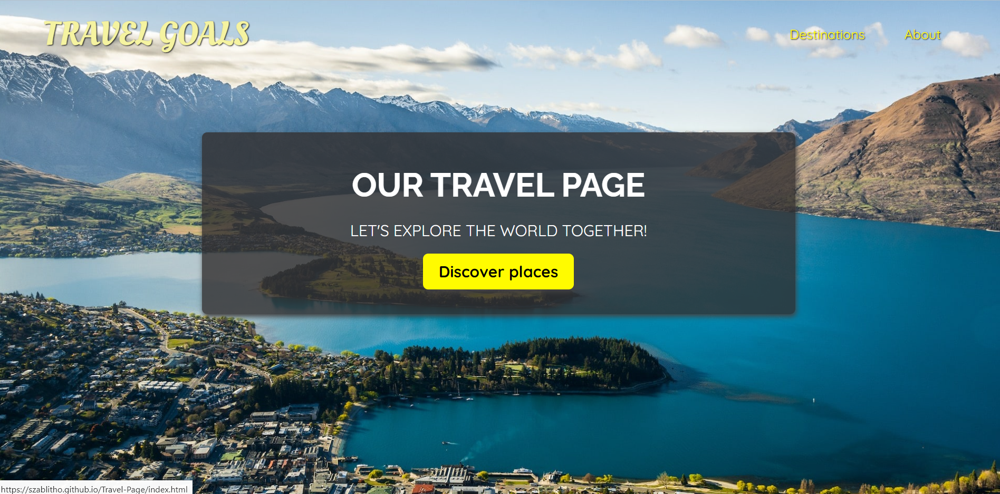

# Travel-Page
I made that page during frontend course. I've used plain CSS and HTMl. Website is about places and attraction in New Zealand.
## Live view: https://szablitho.github.io/Travel-Page/

### Built with

- Semantic HTML5 markup
- rem units
- Flexbox
- CSS Grid
- Mobile-first workflow and PC first workflow( it differs among subsites)
- google fonts
